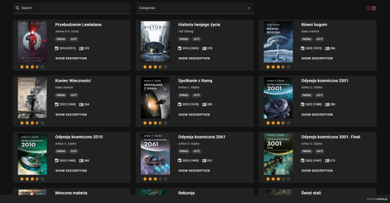

# VUE Books Catalog


## About This Site

VUE Books Catalog is a ready-to-run book catalog site. The project was created to demonstrate how easily a VUE project hosted in a GitHub repository can be integrated and instantly publish changes from the repository to the books.co.pl site using Netlify (continuous integration). My goal was to create a simple VUE application without a prepared backend. Books information is stored in a single JSON file (you can easily change this to using backend endpoints if you want). 

This project uses a VUE 3 with vuetify. You can see working site at [books.co.pl](https://books.co.pl)




## Project setup

### Install the dependencies

```
yarn install
```
After completing the installation, your environment is ready for Vuetify development.

### Starting the Development Server

To start the development server with hot-reload, run the following command. The server will be accessible at [http://localhost:3000](http://localhost:3000):

```bash
yarn dev
```

### Building for Production

To build your project for production, use:

```bash
yarn build
```
Once the build process is completed, your application will be ready for deployment in a production environment.


## Netlify